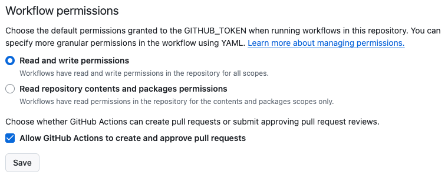
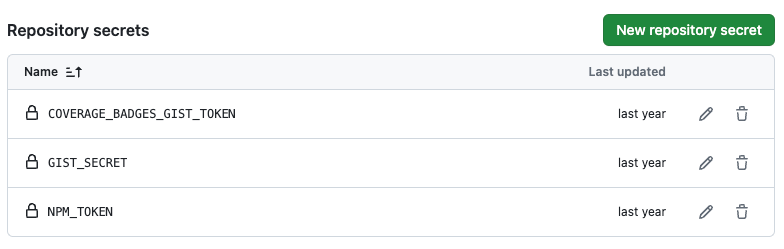

# NxStarter

<a alt="Nx logo" href="https://nx.dev" target="_blank" rel="noreferrer"></a>

✨ **This workspace has been generated by [Nx, Smart Monorepos · Fast CI.](https://nx.dev)** ✨

## Integrate with editors

Enhance your Nx experience by installing [Nx Console](https://nx.dev/nx-console) for your favorite editor. Nx Console
provides an interactive UI to view your projects, run tasks, generate code, and more! Available for VSCode, IntelliJ and
comes with a LSP for Vim users.

## Commitlint CZ-Git Config

### Setup OpenAI token

1. <https://platform.openai.com/account/api-keys>
   Login and create your API secret key, which usually starts with sk-
2. Run command `npx czg --api-key=<API secret key>` and input your key to setup your token save to local

```sh
npx czg --api-key=sk-xxxxx
```

## Semantic Release

### Usage on a Project

In order to release a project, add this executor to its configuration file (ex. `project.json`). Bare minimal configuration looks like this:

```json
{
  "semantic-release": {
    "executor": "@theunderscorer/nx-semantic-release:semantic-release"
  }
}
```

> Hint: You can also use the generator `nx g @theunderscorer/nx-semantic-release:setup-project $PROJECT_NAME` to generate this configuration.

After running this, the executor will do the following:

- Filter commits retrieved by semantic-release in order to find only these that affects selected project or it's
  dependencies.
- Perform semantic-release using following plugins (in this order:)
  - @semantic-release/commit-analyzer
  - @semantic-release/release-notes-generator
  - @semantic-release/changelog
  - @semantic-release/npm
  - @semantic-release/git
  - @semantic-release/github
- The result will be a fully versioned project. If you are releasing it as npm package, the package will be built,
  version in package.json will be updated and package itself will be published.

### Skipping commits

You can skip commits for given projects using `[skip $PROJECT_NAME]` in its body. Ex:

```txt
  feat: update something

  [skip my-app1]
  [skip my-app2]
```

During analysis this commit will be skipped for release pipeline for `my-app1`, `my-app2`.
You can also use `[skip all]` to skip commit for all projects or **one single** `[skip my-app1, my-app2]` to skip commits related to `my-app1`, `my-app2` at once.

---

Alternatively you can include only particular projects in given commit by using `[only $PROJECT_NAME]`. Ex:

```txt
  feat: update something

  [only my-app1]
  [only my-app2]
```

During analysis this commit will be included only for release pipeline for `my-app`, `my-app2`.
You can also use **one single** `[skip my-app1, my-app2]` to skip commits related to `my-app1`, `my-app2` at once.

### Releasing multiple apps/libraries at once

You can release multiple apps/libraries at once by using `nx run-many`:

```shell
npx nx run-many --target=semantic-release --parallel=false
```

> Note: `--parallel=false` is required to run tasks sequentially, otherwise `nx run-many` will run tasks in parallel and semantic-release will fail.

## Start the application

Run `npx nx serve api` to start the development server. Happy coding!

## Build for production

Run `npx nx build api` to build the application. The build artifacts are stored in the output directory (e.g. `dist/` or `build/`), ready to be deployed.

## Running tasks

To execute tasks with Nx use the following syntax:

```
npx nx <target> <project> <...options>
```

You can also run multiple targets:

```
npx nx run-many -t <target1> <target2>
```

..or add `-p` to filter specific projects

```
npx nx run-many -t <target1> <target2> -p <proj1> <proj2>
```

Targets can be defined in the `package.json` or `projects.json`. Learn more [in the docs](https://nx.dev/features/run-tasks).

## Set up CI!

Nx comes with local caching already built-in (check your `nx.json`). On CI you might want to go a step further.

- [Set up remote caching](https://nx.dev/features/share-your-cache)
- [Set up task distribution across multiple machines](https://nx.dev/nx-cloud/features/distribute-task-execution)
- [Learn more how to setup CI](https://nx.dev/recipes/ci)

### Workflow Permissions

Allow read and write permissions and allow GitHub Actions to create and approve pull requests.



### Repo Secrets



## Explore the project graph

Run `npx nx graph` to show the graph of the workspace.
It will show tasks that you can run with Nx.

- [Learn more about Exploring the Project Graph](https://nx.dev/core-features/explore-graph)

## Connect with us!

- [Join the community](https://nx.dev/community)
- [Subscribe to the Nx Youtube Channel](https://www.youtube.com/@nxdevtools)
- [Follow us on Twitter](https://twitter.com/nxdevtools)
